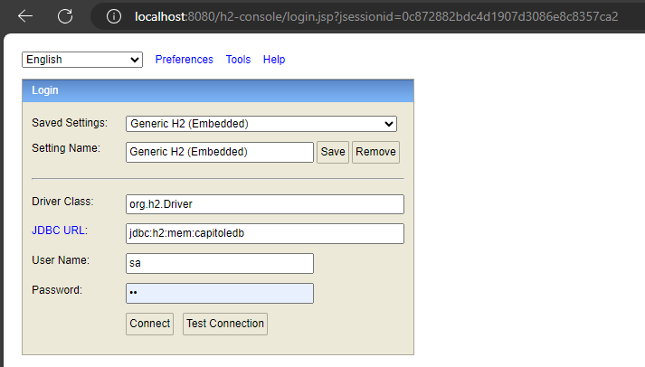
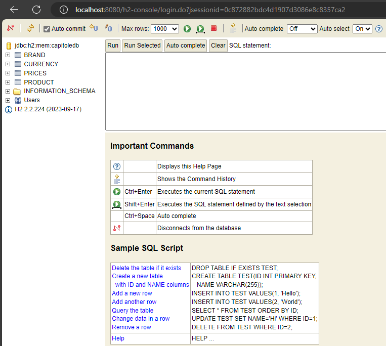
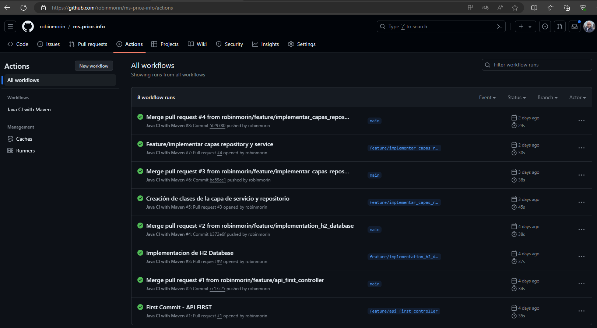
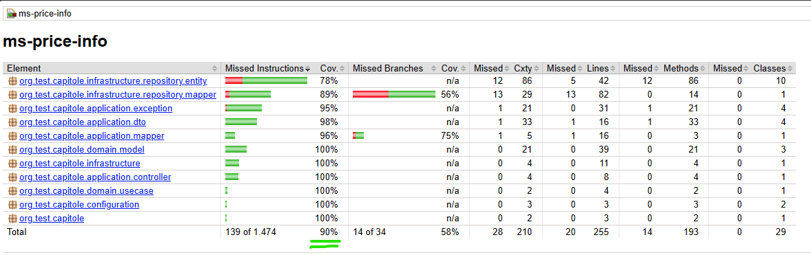
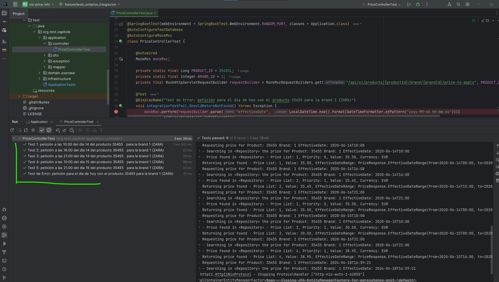
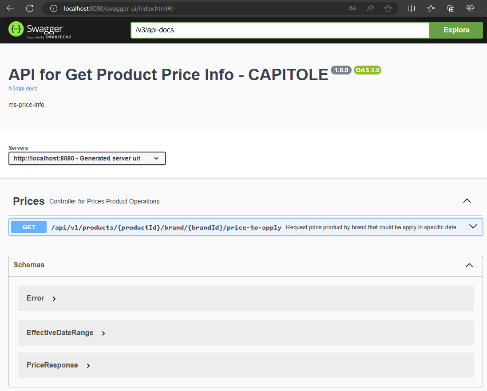
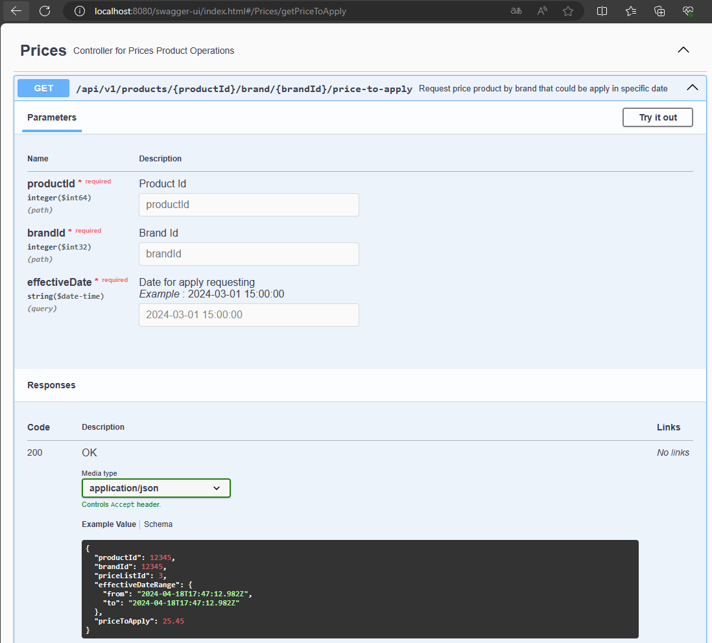

# API for Get Product Price Info - CAPITOLE

### *Descripción*

Este servicio fue desarrollado para consultar el precio a aplicar a los productos de un establecimiento comercial específico, tomando en cuenta la fecha de aplicación de precio. La consulta realizada retornará el precio que haya sido programado, y en caso de existir varias programaciones que apliquen al criterio de busqueda, se tomará el precio que este marcado con mayor prioridad.

-----

### *Estructura del Proyecto*
- El proyecto fue desarrollado siguiendo las mejores practicas de desarrollo de software, eligiendo la **Arquitectura Hexagonal** para tener una mejor organización con la separación de capas de negocio, infraestructura y aplicación.
- Se implementaron design patterns y principios de Clean Code siempre que fue necesario, para garantizar la calidad del código y la escalabilidad del servicio.
- Se implementaron tests unitarios y de integración para garantizar la funcionalidad del servicio.
-----

### *Stacks y librerias usadas en este microservicio*
- Spring Boot 3.2.3
- Java 17 (a partir de la versión 3 de Spring Boot, es requerido Java 17)
- Spring Data JPA 3.2.3
- H2 Database 2.2.224
- Lombok 1.18.30
- Spring Doc 2.3.0 (Swagger Specifications OAS 3.0)
- JUnit Jupiter 5.10.2
- Mockito 5.7.0
-----

### *Configuración y Base de Datos*
- Spring Boot con los parametros establecidos en el application.yml, crea automáticamente la conexión con la base de datos H2, simplificando la configuración y el despliegue del microservicio.
- La entidades son automaticamente generadas en la base de datos H2, a partir de las definiciones hechas en las clases de entidades.
- Usando el mecanismo de Hibernate, se populo la base de datos con datos de prueba, a partir del archivo `import.sql` que se encuentra en el directorio `src/main/resources`.

>Una vez que el servicio esta en ejecución, se puede acceder a la consola de H2
>### Console URL: http://localhost:8080/h2-console
>

>### Tablas Creadas y populadas con datos de prueba
>

-----

### *Repositorio e Integración Continua (CI/CD)*
 - El codigo esta siendo entregado en un repositorio publico de Github
 - Las funcionalidades de este servicio han sido desarrollados en branchs feature cada una.
 - Configuré un Github Workflow (`archivo .github/workflows/maven.yml`) para ejecutar un [mvn -B clean test package], para certificar que no existe codigo ni fucionalidad quebrada en la branch que se esta mezclando.
 - Cuando se hace merge de la feature para main, se ejecuta nuevamente el Workflow que compila y ejecuta los tests unitarios y de integración, certificando asi que se tiene un servicio libre de errores y que mantiene la funcionalidad de negocio garantizada.
 - Esta claro que flujo correcto de entregas a la branch main, deberia ser bajo el modelo de `GitFlow`, pero no fue requimiento explicito de este test.



-----
## Tests Unitarios y de Integración

- Este servicio contiene tests unitarios desarrollados con JUnit5 y Mockito, que abarcan por lo menos el 90% cobertura de las clases de negocio y de infraestructura.

    >### Reporte de cobertura de los tests unitarios (Jacoco)
    >

- Se implementaron tests de integración para garantizar la funcionalidad del servicio.

    >### Test de Integración (org.test.capitole.application.controller.PriceControllerTest)
    >

-----

### Ejecución del microservicio e interfaz de usuario

   - Para la ejecución del microservicio puede usar el siguiente comando:

   ```bash
   mvn spring-boot:run
   ```
   Recuerde que esta configurado para subir en el puerto 8080.

- Para acesso a la API tiene dos opciones:
    - Una vez que el servicio esta disponible en la puerta 8080, puede ejecutar el siguiente cURL con los parametros necesarios para busqueda:

  ```bash
  curl --location 'http://localhost:8080/api/v1/products/35455/brand/1/price-to-apply?effectiveDate=2020-06-14%2010%3A00%3A00' --header 'accept: application/json'
  ```
    - Una vez que el servicio esta disponible en la puerta 8080, puede usar la interfaz Swagger en la siguiente Url:

  ```bash
  http://localhost:8080/swagger-ui/index.html
  ```
   >### Swagger UI: http://localhost:8080/swagger-ui/index.html
   >

   >### Click en [Try it out] para rellenar los datos para la busqueda
   >

-----
